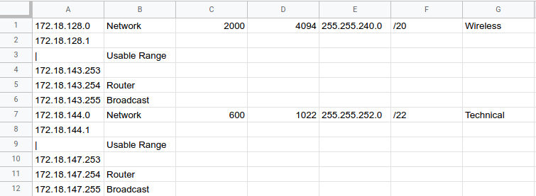

# "DSL" for subnets

It is more like a programmatic way of creating the IP documentation.

## Example

``` haskell
import Data.Subnet
import IP.Documentation

subnets = [ Subnet "172.18.128.0" 20 2000 "Wireless"
          , Subnet "172.18.144.0" 22 600 "Technical"
          ]
          
main :: IO ()
main = printCsvSubnets subnets
```

The source code above should generate a CSV content that can be imported into
Google's Sheets or Microsoft's Excel for the following result.



## Other ideas

Feel free to implement these.

- Connect to Google Drive and generate the Sheets directly.
- Write this in Google's Apps Script for Sheets, so user can just click the button to get a new sheet
  with the IP documentation from data in the current sheet.
- Work with the xlsx format directly to pre-apply the style for each subnet.
